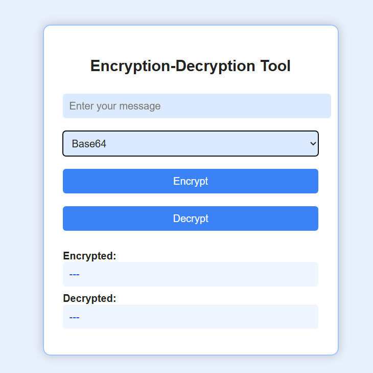
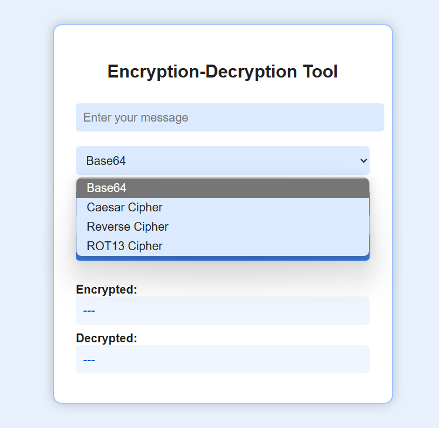

# 🔐 Encryption-Decryption Tool

This is a beginner-friendly web application that allows users to **encrypt and decrypt messages** using four basic encryption techniques: **Base64**, **Caesar Cipher**, **Reverse Cipher**, and **ROT13**. It is designed as an educational cybersecurity project using **HTML**, **CSS (blue theme)**, and **JavaScript**.

---

## 🚀 Live Demo

> (Optional: Add your GitHub Pages or Netlify link here)  
> [🔗 View Live][(http://127.0.0.1:5500/index.html))

---

## 📸 Screenshot

---

## 🔧 Features

- 🔤 **Base64 Encoding/Decoding**  
  Converts plain text to Base64 format and back.

- 🔁 **Reverse Cipher**  
  Reverses the input string, useful for visual encryption understanding.

- 🔐 **Caesar Cipher**  
  Shifts each character by +3 or -3 to encode/decode the message.

- 🔄 **ROT13 Cipher**  
  Shifts each letter by 13 positions. Same function is used for both encrypting and decrypting.

